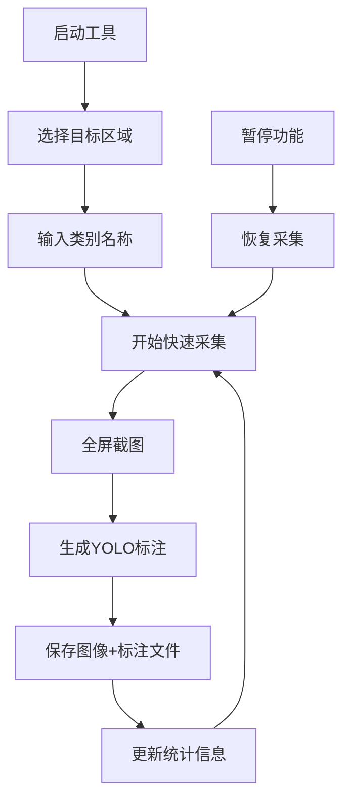

# 📸 YOLO数据采集工具 v2.1

## 🎯 功能概述

智能化全屏图像数据采集工具，专为YOLO目标检测训练数据生成而设计。采用**全屏截图 + 目标区域标注**的模式，自动生成YOLO格式的训练数据。

### ✨ 核心特性

- 🖥️ **全屏截图** - 捕获完整的屏幕画面
- 🎯 **目标区域标注** - 用户框选目标区域，自动生成YOLO格式标注
- 📁 **智能数据管理** - 自动创建分类目录和标注文件
- ⚡ **热键操作** - 支持自定义快捷键快速采集
- 📊 **实时统计** - 显示采集进度和数据统计
- 🔄 **增量采集** - 支持在现有数据基础上继续采集

## 📂 数据结构

```
data/
├── raw/
│   ├── images/          # 图像文件
│   │   ├── 等待上钩状态/
│   │   │   ├── 等待上钩状态001.jpg
│   │   │   ├── 等待上钩状态002.jpg
│   │   │   └── ...
│   │   └── 进入钓鱼状态/
│   │       ├── 进入钓鱼状态001.jpg
│   │       └── ...
│   └── labels/          # YOLO标注文件
│       ├── 等待上钩状态/
│       │   ├── 等待上钩状态001.txt
│       │   ├── 等待上钩状态002.txt
│       │   └── ...
│       └── 进入钓鱼状态/
│           ├── 进入钓鱼状态001.txt
│           └── ...
└── class_mapping.txt    # 类别映射文件
```

## 🎮 使用指南

### 1️⃣ 启动工具

```bash
# 进入数据采集模块目录
cd modules/data_collector

# 启动数据采集工具
python main.py
```

### 2️⃣ 选择目标区域和设置类别

1. 点击 **"🎯 选择目标区域并设置类别"** 按钮 (或按 `Ctrl+Alt+Y`)
2. 在全屏界面上**拖拽鼠标框选目标区域**
3. 松开鼠标后输入类别名称 (如: `等待上钩状态`)
4. 系统会自动设置类别并准备开始采集

### 3️⃣ 开始数据采集

- **快速采集**: 按 `Y` 键 或点击 **"📸 快速采集"** 按钮
- **暂停采集**: 按 `Ctrl+Alt+P` 暂停/恢复采集功能

### 4️⃣ 查看数据统计

- 右侧面板实时显示采集统计
- 包含图像数量、标注文件数量、类别ID等信息
- 支持点击类别名称打开对应文件夹

## 📋 YOLO标注格式

每个图像文件对应一个`.txt`标注文件，格式为：

```
class_id center_x center_y width height
```

- **class_id**: 类别ID (从0开始)
- **center_x, center_y**: 目标中心点坐标 (归一化 0-1)
- **width, height**: 目标宽高 (归一化 0-1)

示例标注文件内容：
```
0 0.512000 0.345000 0.156000 0.089000
```

## ⚙️ 配置说明

### 🔧 热键配置

| 功能 | 默认热键 | 描述 |
|------|----------|------|
| 选择目标区域 | `Ctrl+Alt+Y` | 开始选择目标区域并设置类别 |
| 快速采集 | `Y` | 执行全屏截图+标注保存 |
| 暂停/恢复 | `Ctrl+Alt+P` | 暂停或恢复采集功能 |

可通过界面的 **"⚙️ 热键设置"** 按钮自定义热键。

### 📸 图像设置

- **格式**: JPG (推荐) / PNG
- **质量**: 95% (JPEG质量)
- **分辨率**: 保持原屏幕分辨率

## 🔄 工作流程



## 📊 数据管理特性

### 🏷️ 自动类别管理

- 自动为新类别分配唯一ID
- 类别映射保存在 `data/class_mapping.txt`
- 支持中文类别名称

### 📈 增量采集支持

- 检测现有数据，自动继续编号
- 避免文件名冲突
- 显示当前类别的已有数据量

### 📋 统计信息

- **实时统计**: 各类别图像和标注数量
- **可视化展示**: 彩色图表显示数据分布
- **快速访问**: 点击类别名称打开文件夹

## 🚀 性能优化

- **快速截图**: 使用MSS库，平均耗时 < 100ms
- **内存管理**: 图像预览自动缩放，减少内存占用
- **热键响应**: 全局热键监听，无需窗口聚焦

## 🛠️ 故障排除

### 常见问题

1. **热键不响应**
   - 检查是否有其他程序占用相同热键
   - 尝试重新设置热键

2. **截图失败**
   - 确保没有其他程序锁定屏幕
   - 检查磁盘空间是否充足

3. **标注文件错误**
   - 确保目标区域不超出屏幕边界
   - 检查类别名称是否包含非法字符

### 日志查看

程序运行日志保存在 `logs/` 目录下，可用于问题诊断。

## 🔧 技术架构

### 核心模块

- **main.py**: 主程序界面和逻辑控制
- **screen_capture.py**: 屏幕截图和区域选择
- **data_manager.py**: 数据保存和YOLO标注生成
- **hotkey_listener.py**: 全局热键监听
- **config_manager.py**: 配置文件管理

### 依赖库

```python
# 核心依赖
mss==9.0.1              # 高性能屏幕截图
Pillow>=10.0.0          # 图像处理
pynput>=1.7.6           # 全局热键监听

# GUI依赖
tkinter                 # 图形界面 (Python内置)

# 工具依赖  
PyYAML>=6.0             # 配置文件解析
```

## 📝 更新日志

### v2.1 (当前版本)
- ✅ 全屏YOLO数据采集模式
- ✅ 自动生成YOLO格式标注文件
- ✅ 新的数据目录结构 (data/raw/)
- ✅ 类别ID自动管理
- ✅ 增强的统计信息显示
- ✅ 带目标框的预览功能

### v2.0 (历史版本)
- ✅ 模块化重构
- ✅ 图形化界面
- ✅ 热键系统
- ✅ 配置管理

---

> 💡 **提示**: 建议在数据采集前先规划好类别命名规范，确保数据的一致性和后续训练的效果。 